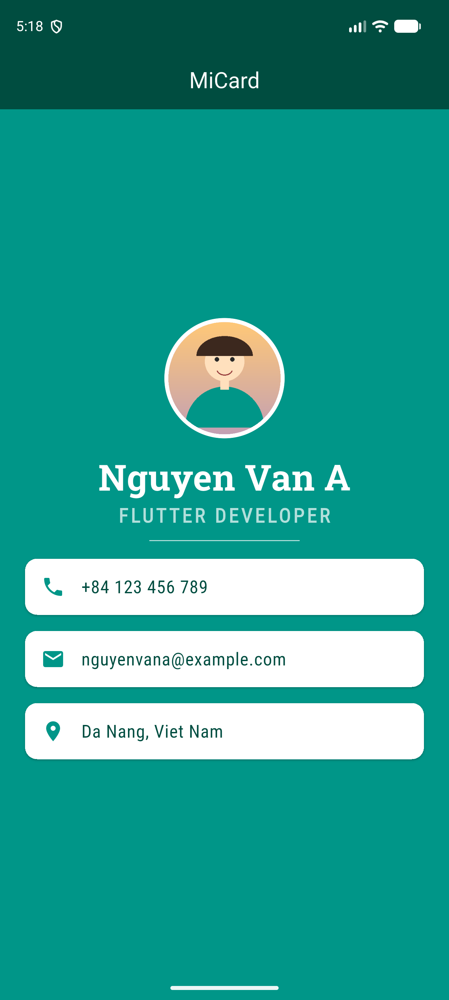

# Lab 2: MiCard

Danh thiếp kỹ thuật số: ảnh đại diện, tên, nghề nghiệp và thông tin liên lạc.

## Chức năng

- Ảnh đại diện dạng `CircleAvatar` lấy từ `images/avatar.png`.
- Font tùy chỉnh (`RobotoSlab`, `RobotoCondensed`) khai báo trong `pubspec.yaml`.
- Thông tin liên lạc hiển thị bằng `Card` + `ListTile` (widget tái sử dụng `InfoCard`).

## Cấu trúc chính

- `lib/main.dart`
- `images/`
- `fonts/`

## Chạy ứng dụng

```bash
flutter pub get
flutter run
```

## Demo


